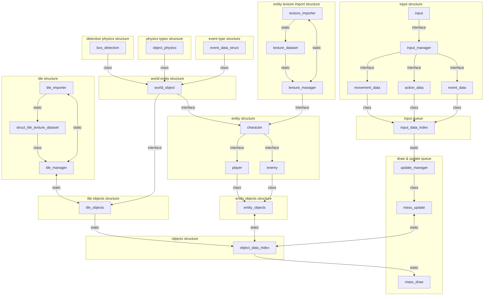

```mermaid
flowchart TD

    subgraph detection physics structure
    box_detection
    end

    subgraph physics types structure
    object_physics
    end

    subgraph event type structure
    event_data_struct
    end

    subgraph world entity structure
    world_object
    box_detection -->|class| world_object
    object_physics -->|class| world_object
    event_data_struct -->|class| world_object
    end

    subgraph entity structure
    character
    character -->|interface| player
    character -->|interface| enemy
    world_object -->|interface| character
    end

    subgraph entity objects structure
    entity_objects
    player -->|class| entity_objects
    enemy -->|class| entity_objects
    end

    subgraph input structure
    input 
    input_manager
    input -->|interface| input_manager
    input_manager -->|interface| movement_data
    input_manager -->|interface| action_data
    input_manager -->|interface| event_data
    end

    subgraph input queue
    input_data_index
    movement_data -->|class| input_data_index
    action_data -->|class| input_data_index
    event_data -->|class| input_data_index
    end
    
    subgraph tile structure
    tile_importer
    tile_manager
    struct_tile_texture_dataset
    tile_manager <-->|static| tile_importer
    tile_importer -->|static| struct_tile_texture_dataset
    struct_tile_texture_dataset -->|class| tile_manager
    end

    subgraph entity texture import structure
    texture_importer
    texture_manager
    texture_dataset
    texture_manager <-->|static| texture_importer
    texture_importer -->|static| texture_dataset
    texture_dataset -->|static| texture_manager
    texture_manager -->|interface| character
    end

    subgraph tile objects structure
    tile_objects
    tile_manager <-->|static| tile_objects
    world_object -->|interface| tile_objects
    end

    subgraph draw & update queue
    mass_draw
    mass_update
    update_manager
    input_data_index -->|static| update_manager
    update_manager -->|class| mass_update
    end

    subgraph objects structure
    object_data_index
    tile_objects -->|static| object_data_index
    entity_objects <-->|static| object_data_index
    mass_update <-->|static| object_data_index
    object_data_index -->|static| mass_draw
    end

```