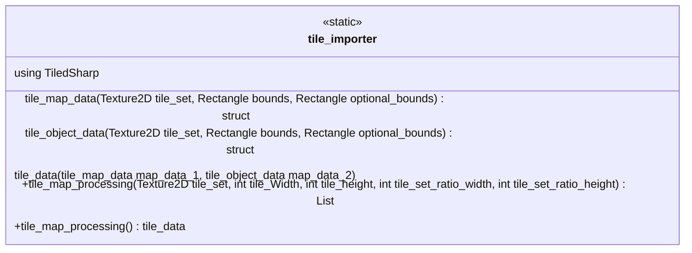

```mermaid
classDiagram
    class tile_importer{
        <<static>>
        using TiledSharp

        tile_map_data(Texture2D tile_set, Rectangle bounds, Rectangle optional_bounds) struct
        tile_object_data(Texture2D tile_set, Rectangle bounds, Rectangle optional_bounds) struct

        tile_data(tile_map_data map_data_1, tile_object_data map_data_2)

        +tile_map_processing(Texture2D tile_set, int tile_Width, int tile_height, int tile_set_ratio_width, int tile_set_ratio_height) List
        +tile_map_processing() tile_data
    }


```